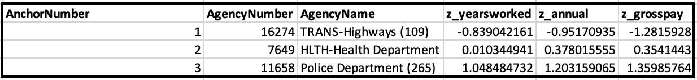
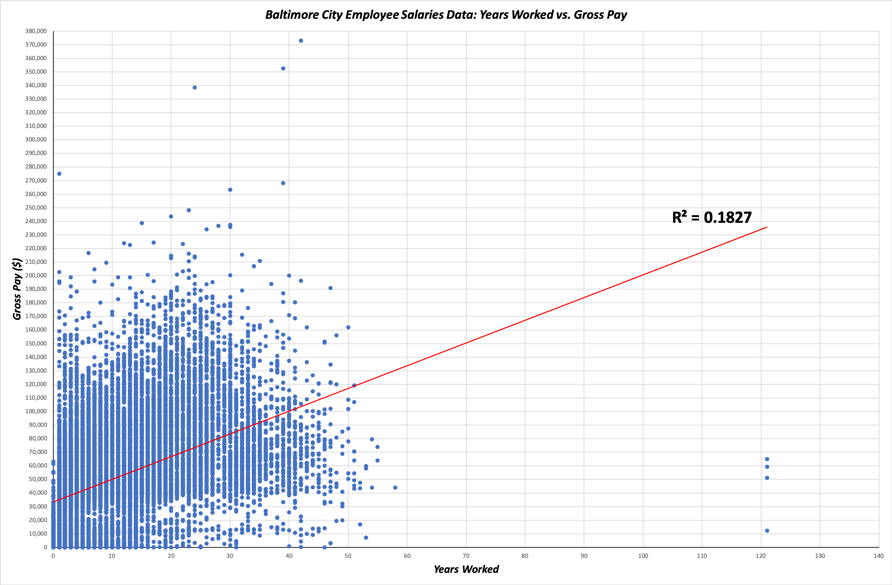

# Categorizing Agencies Based on Years Worked, Annual Salary, and Gross Pay of the 2020 fiscal year in Baltimore, MD. 
## Background Information 
The 21st Century Cities Initiative at JHU conducts urban research to examine the implications of urban economic growth - a 2019 [report](https://21cc.jhu.edu/research/police-overtime-and-baltimore-citys-budget/) of Baltimore Police Department salaries revealed that the median pay for a Baltimore police officer increased by 60% from 2011 to 2018. Understaffed departments demanded officers to work overtime shifts, causing the drastic increase in gross pay. With this knowledge, how do police officer employee salaries in Baltimore compare to that of other occupations, and which variables influence employee salaries? If we plot Baltimore employee salaries of all sectors for one fiscal year, can we observe occupations of similar salaries grouped together visually?
## Business Question 
Looking at 2020 fiscal year's employee salaries in Baltimore, how can we categorize agencies using years worked, anuual salary, and gross pay of each occupation?
## Data Question 
Working from [Baltimore City Employees Salaries Data](https://data.baltimorecity.gov/City-Government/Baltimore-City-Employees-Salaries/w28m-utix), raw data points were pulled from Agency Name, Hire Date, Annual Salary, and Gross Pay in FY2020. The number of years worked at each occupation was calculated from (2020 - year of hire date). The final [dataset](cluster_analysis.xlsx) used for cluster analysis included z-scores, distance to reference data point in each cluster, and anchor numbers.
## Data Answer 

Cluster analysis of the dataset allowed us to identify clusters, or groups, of similar data points. In the context of Baltimore employee salaries, clusters were defined by z-score (measurement of number of standard deviations above or below the mean) of years worked at agency, annual salary, and gross pay. All z-scores were calculated using the mean and standard deviation of years worked, annual salary, and gross pay of all agency occupations reported in FY2020. In cluster 1, occupations such as crossing guards and highways maintanence employees worked fewer years in their profession than the average, and reported lower than average annual salary and lower than average gross pay. In cluster 2, occupations of the health department and Department of Public Works (specifically sewer management) worked for a number of years very close to the mean, and had slightly higher than average annual salary and gross pay. Lastly, for cluster 3, occupations from Baltimore Polic Deparment and Fire Department reported higher than average years worked, annual salary, and gross pay.

The z-scores of each cluster suggests a positive correlation between years worked and gross pay - the higher the number of years worked at an agency, the higher the gross pay. The scatter plot below confirms the slight positive correlation between the two variables. 
 

## Limitations to Cluster Analysis and Next Steps

